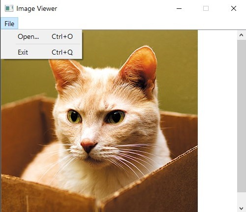
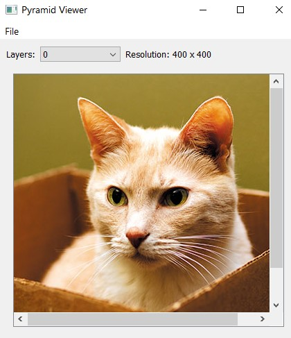
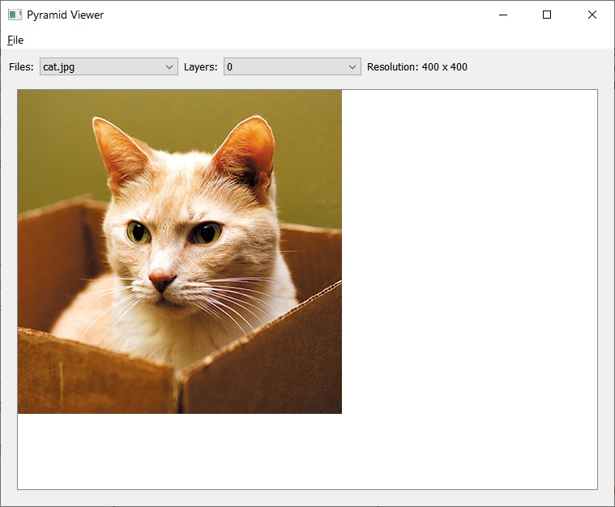
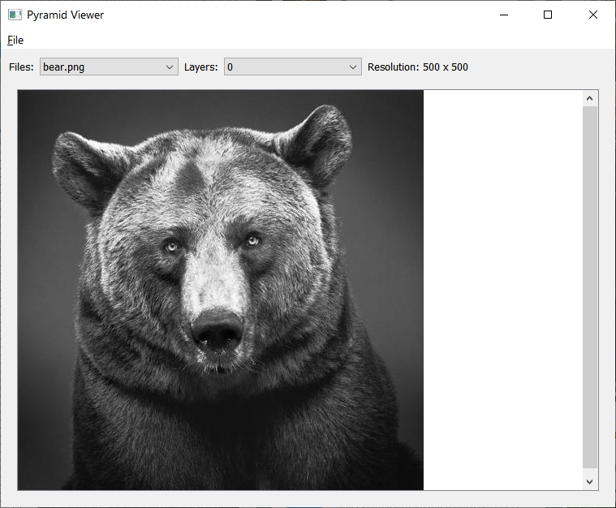
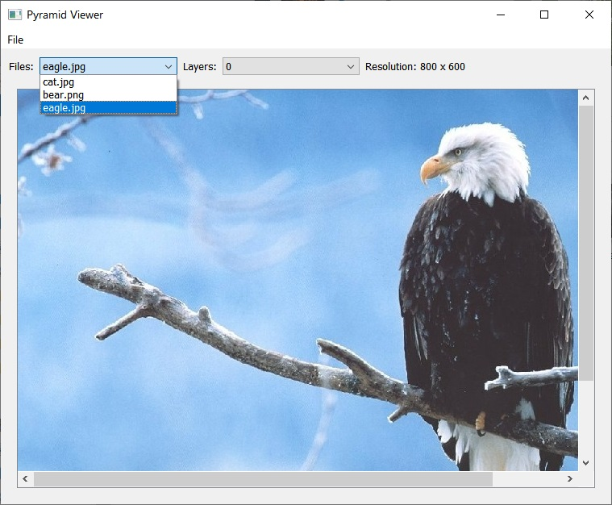
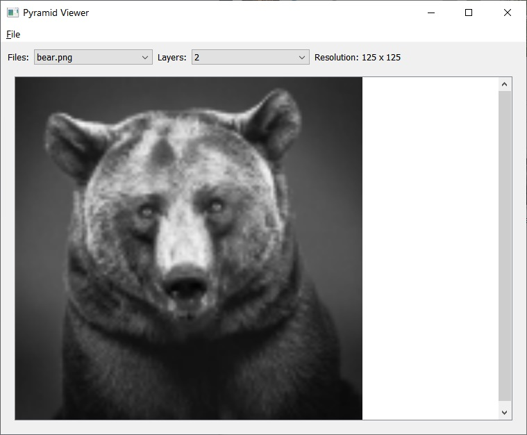
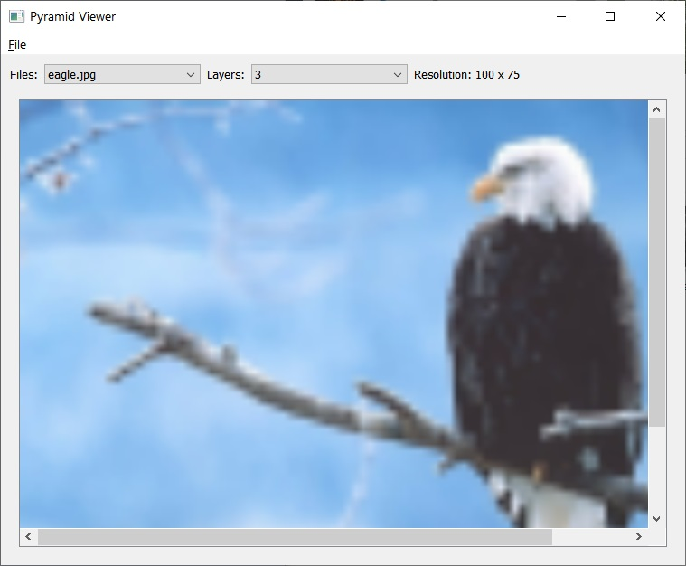

Задание №5: Разработайте приложение с помощью фреймворка Qt, используя QWidgets.
Пирамида изображений - набор изображений, в котором каждое следующее изображение (слой
пирамиды) получено путем уменьшения предыдущего в 2 раза.

1. Приложение позволяет выбрать файл изображения png или jpg из пункта меню и показывает его
содержимое. Если размер изображения превышает размеры окна приложения, то должны
появиться scrollbar-ы для перемещения по изображению.

	
	
Первая версия приложения

2. При загрузке изображения по нему строится пирамида изображений.
3. Должна быть предусмотрена возможность произвольного переключения между слоями и
оригинальным изображением с отображением номера слоя и его размера в пикселях. (т.е слои
можно "листать", например с помощью combobox). При отображении каждый слой должен быть
увеличен до размера оригинального изображения (таким образом содержимое его “замылится”).

	
	
	
Вторая версия приложения

4. Реализовать открытие нескольких файлов с возможностью их переключения. Отобразить список
открытых файлов с помощью комбобокса. Список отсортировать в порядке увеличения
диагонали изображения.

	
	
	
	
	
	
	
Третья версия приложения

